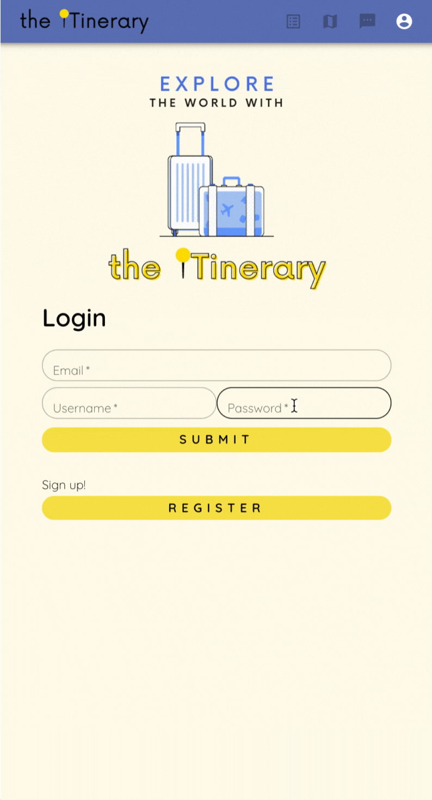

## About
**The ITinerary** is a quick and easy-to-use itinerary generator application that can alleviate the stress in planning for the next adventure. 

**Features:**
* **CREATE AN APP IN LESS THAN 5 MINUTES**: Create an itinerary for any city in the world! 

* **OPTIMIZED DAILY PLAN:** 
The ITinerary generates equal amount of activities per day (with the possible exception of the trip's last day).

* **SHORTER TRANSIT TIME BETWEEN ACTIVITIES:** Daily activities are grouped based on relative proximity to one another. This eliminates the hassle of travelling across town to the next activity!

* **ADD YOUR FRIENDS:** The ITinerary app allows for a user to add registered users to let them in on the plan and group chat!


*Note: The ITinerary was built as a fulfillment to Lighthouse Lab's final project requirement. This demo is intended for mobile viewing only.*

*Created by: Leland M. ([**@lmckibben**](https://github.com/lmckibben)), Jennifer L. ([**@jenlaw266**](https://github.com/jenlaw266)), and Ysabel G. ([**@ysabelgarcia10**](https://github.com/ysabelgarcia10))*

## Final Product
#### Login/Register



#### Create an Itinerary


#### Itinerary Map


#### Edit Itinerary


#### Add Members to Trip


#### Chat with Other Members


#### View Past Trips


## Getting Started
1. Clone this 
repository.
```
git clone https://github.com/jenlaw266/theitinerary-finals.git
```

2. Navigate to the directories and install the dependencies.
```
cd theitinerary-finals/express-back-end
npm install
cd theitinerary-finals/new-react
npm install
cd theitinerary-finals/chat-server
npm install
```

3. Navigate to the express server directory and run a database reset.
```
cd theitinerary-finals/express-back-end
npm run db:reset
```

4. Open three terminal windows to launch the front-end, back-end, and chat servers.
```
cd theitinerary-finals/express-back-end
npm start
cd theitinerary-finals/new-react
npm start
cd theitinerary-finals/chat-server
npm start
```

5. Visit `http:localhost:3000/` to view the application.

### Setting up the API
1. Ensure that you have an API key with Google Cloud Platform (you can set it up at `https://console.cloud.google.com/apis/credentials`) . Enable the following API on your dashboard:
* Maps JavaScript API
* Service Usage API
* Places API
* Geocoding API

2. Within your express-back-end and new-react directories, add the following in your **.env** file:

* *REACT_APP_API_KEY = your_key_here*


## Dependencies
### Backend
* axios
* bcrypt
* body-parser
* cookie-session
* cors
* dotenv
* express
* postgresql

### Frontend
* axios
* framer motion
* google react map
* material ui
* react
* sass
* socket.io
* styled components

### Others
* Google Places API
* Google Map JavaScript API 
* Google Geocoding API
* Google Service Usage API

## Credits
This repository is a bootleg of @NimaBoscarino's [React Rails Boilerplate](https://github.com/NimaBoscarino/react-rails-boilerplate). It uses the same React app, but replaces the Rails server with an Express server.
